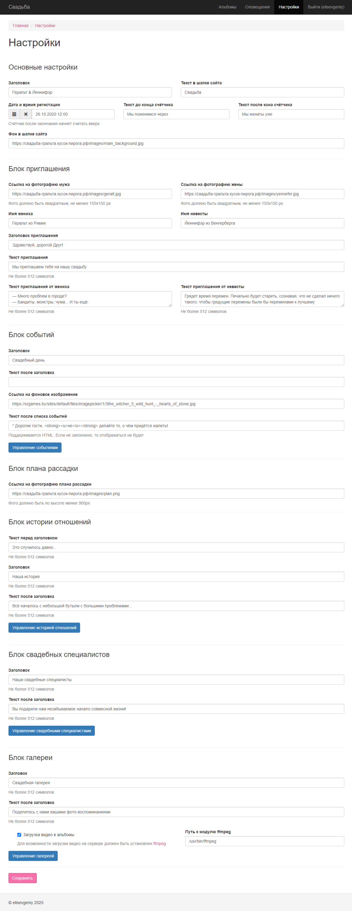
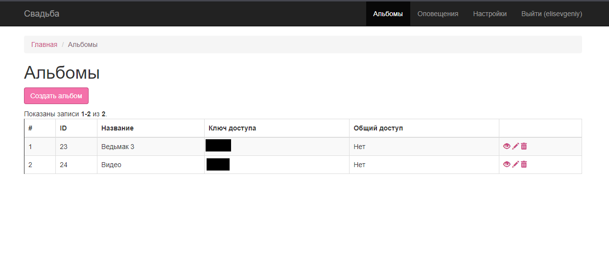
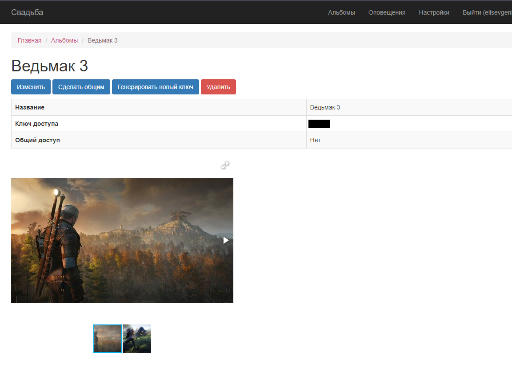
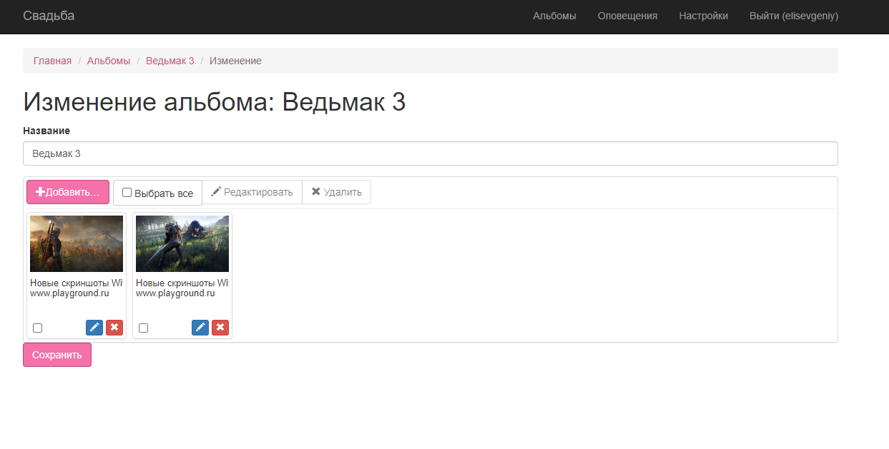
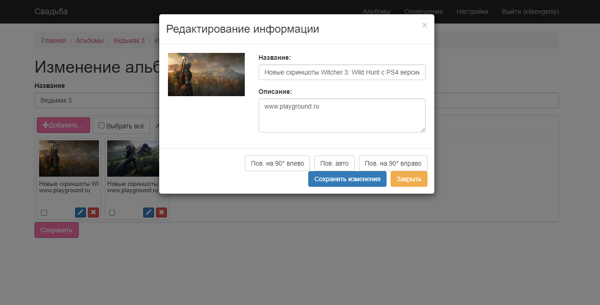
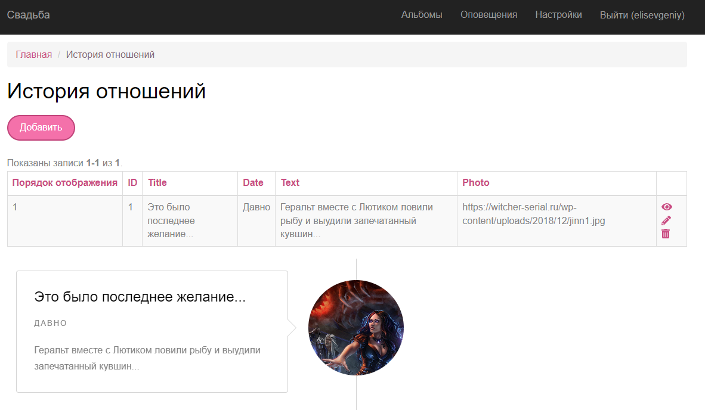
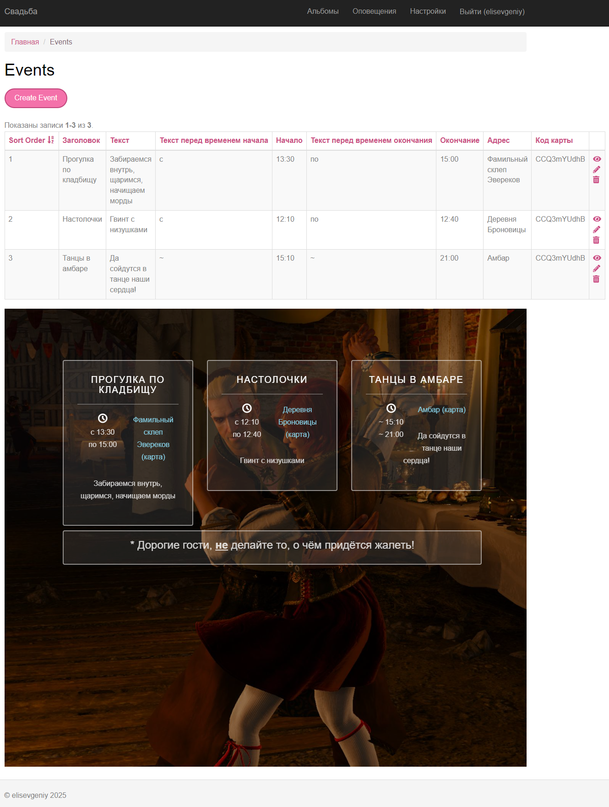
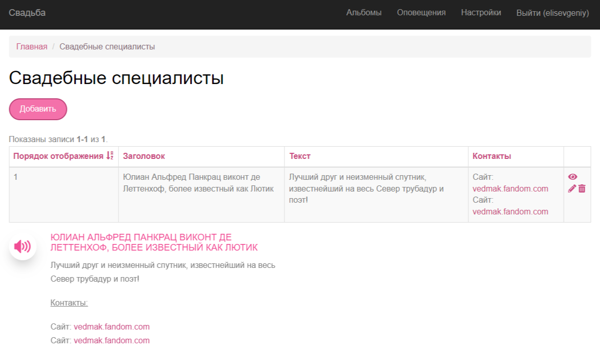
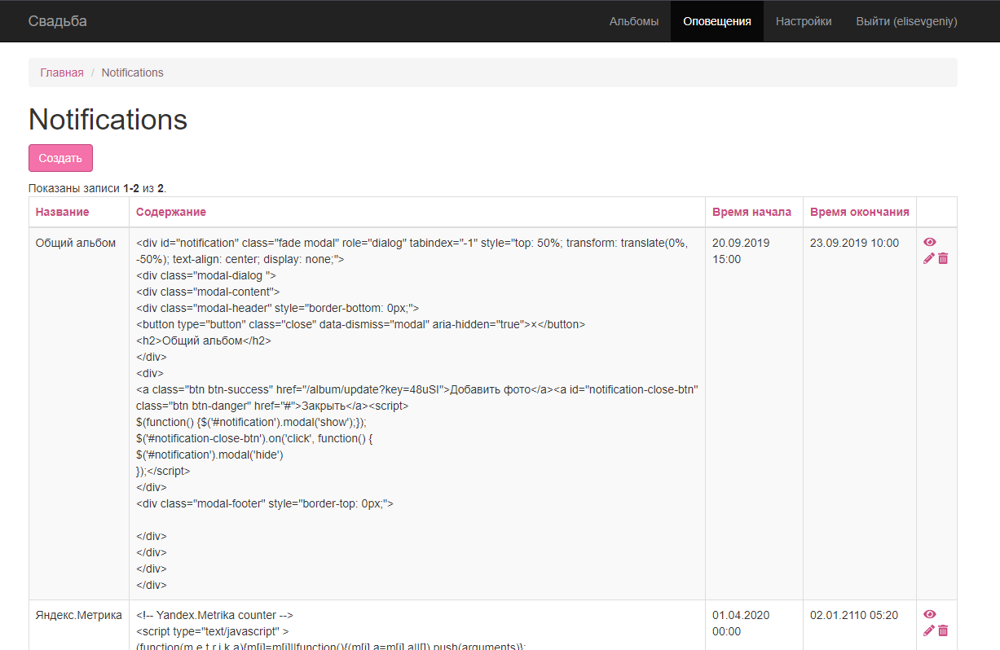
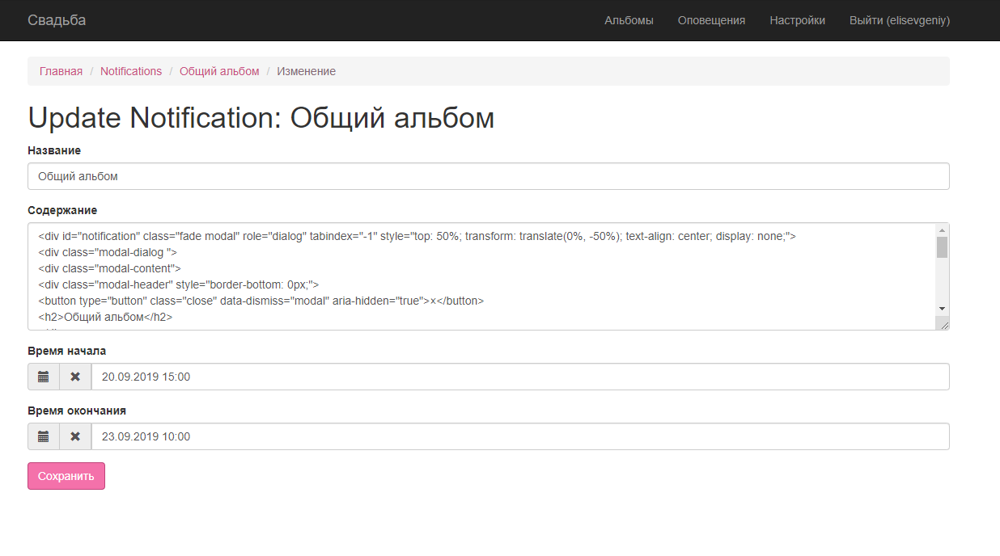

# Свадебный сайт
Полноценный сайт для представления информации о свадебном дне и хранения воспоминаний долгие годы спустя. 

Основан на [wedding-website](https://github.com/rampatra/wedding-website)

Демо версия для Геральта: [ссылка](http://свадьба-гральта.кусок-пирога.рф) (без доступа в панель управления)

## Функционал
- Счётчик времени до свадьбы и после свадьбы
- Преветственный слова молодёжонов  
- Расписание свадебного дня со временем, картой и описанием
- План рассадки
- Красивый таймлайн с историей отношений
- Информация о свадебных специалистах
- Галерея с фото и видео. Доступ к альбому по ключу, регистрация не требуется!

## Панель управления
- Настройка любых изображений и текстовых блоков на сайте
- Настройка расписания свадебного дня, истории отношений, специалистов, галереи

## Установка
1. `$ cd wedding-website` - зайдите в каталог с сайтом
2. `$ composer install` - установите требуемые библиотеки
3. В файле `./models/User.php` устаните логин/пароль администратора:
```php
private static $users = [
        '100' => [
            'id' => '100',
            'username' => 'admin',
            'password' => 'admin',
            'authKey' => 'test100key',
            'accessToken' => '100-token',
        ]
    ];
```
4. Профит!

## Скриншоты панели управления

- Настроки
<div>
    <a href="images/settings.png" target="_blank">
        </img> 
    </a>
</div>

- Альбомы
<div>
    <a href="images/albums.png" target="_blank">
        </img> 
    </a>
    <a href="images/album.png" target="_blank">
        </img> 
    </a>
    <a href="images/album_edit.png" target="_blank">
        </img> 
    </a>
    <a href="images/album_edit_photo.png" target="_blank">
        </img> 
    </a>
</div>

- История отношений
<div>
    <a href="images/couple-story.png" target="_blank">
        </img> 
    </a>
</div>

- События (Расписание свадебного дня)
<div>
    <a href="images/events.png" target="_blank">
        </img> 
    </a>
</div>

- События (Специалисты)
<div>
    <a href="images/service.png" target="_blank">
        </img> 
    </a> 
</div>

- Напоминания
<div>
    <a href="images/notifications.png" target="_blank">
        </img> 
    </a>
    <a href="images/notification_edit.png" target="_blank">
        </img> 
    </a>
</div>

